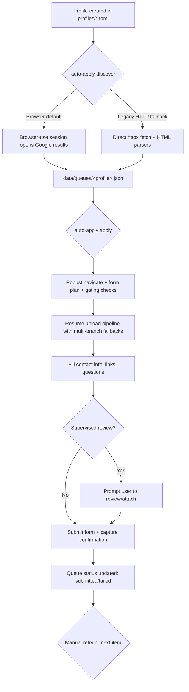
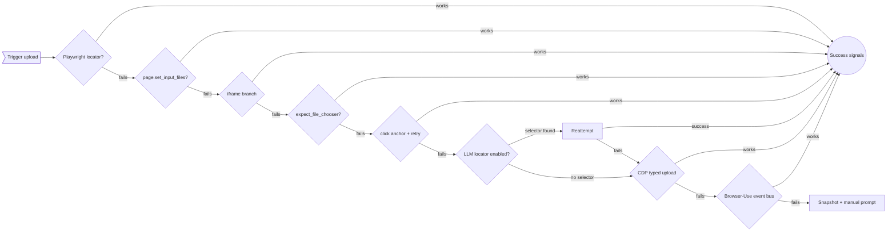

# Application Workflow Overview

This document summarizes how the CLI orchestrator, discovery crawler, and Lever apply agent work together inside Job-AI-Auto-Apply-UI. It focuses on the order of operations, built-in fallbacks, and where LLM/AI assistance appears.

## High-Level Flow

### Primary Components

- **Profiles**: TOML files describing defaults, keywords, prompts, preferred browser channel, and user data dir. `Profile.resolve_resume_path` respects relative paths.
- **ApplicationQueue**: JSON per profile under `data/queues/`. Tracks status transitions (NEW, IN_PROGRESS, SUBMITTED, FAILED, CAPTCHA_BLOCKED) and tolerates UTF-8 BOM edits.
- **Telemetry**: All major actions emit structured JSON logs via `structlog` (`auto_apply` logger), enabling replayable timelines.

## Discover Command (`cmd_discover`)

1. **Profile Load**: Attempts to load `profiles/<id>.toml`. Missing file falls back to a minimal inline profile.
2. **Search Query**: `build_search_query` extracts up to six unique keywords from `profile.discovery_terms()` and wraps them into a `site:jobs.lever.co (...)` Google query.
3. **Execution Mode**:
   - **Browser-first (default)**: `_discover_with_browser_session`
     - Launches a Browser-Use `BrowserSession` with stealth environment (locale/timezone/env vars) and limited allowed domains (`google.com`, `jobs.lever.co`).
     - Navigates to the search URL, waits for Google results via DOM polling, captures HTML, and parses Lever links.
     - Iterates results (capped) and opens each job in a new tab for richer extraction. Uses in-page JavaScript to gather title, location, department, work model, and discover an `applyUrl` (falls back to listing URL).
   - **Legacy HTTP / forced fallback**: Triggered when `AUTO_APPLY_BROWSER_MODE` is `off|disabled|http` or tests inject `fetch_search`.
     - Uses `httpx` to fetch Google results and, for each listing, optionally fetches the posting HTML. `_LeverPostingParser` (HTMLParser) extracts structured fields if HTML is available.
4. **Item Normalization**: Every result becomes an `ApplicationItem` with deduped hash, discovery timestamp, and `JobDetails` excerpt. Duplicates (by hash) are skipped during queue enqueue.
5. **Queue Persistence**: New items stored via `ApplicationQueue.enqueue`. Structured log `discover.results` captures counts.

**AI Usage**: Discovery does not call LLMs by default. It relies on deterministic parsers and DOM evaluation. Only static heuristics, no model calls.

**Fallback Order Summary**
1. Browser session (preferred) with DOM scraping.
2. HTTP fallback with HTML parsing if browser mode disabled or errors.
3. For each posting, if browser extraction fails, the code still enqueues a minimal item using Google title/snippet.

## Apply Command (`cmd_apply`)

1. **Profile & Mode**: Loads profile; determines supervised vs auto. CLI flags override env vars for LLM locator, debug snapshots, and resume timeout.
2. **LLM Settings**: `load_llm_config` merges env + flags. Provider/model can be overridden per run.
3. **Iterating Queue**: `iter_apply_events` pulls pending items from `ApplicationQueue`. Each item processed inside `_browser_apply_one`.
4. **Browser Session Launch**: `LeverBrowserOptions.from_settings()` sets allowed domains (from env), stealth env (TZ/LANG/LC_ALL), viewport, artifact paths, and disables default extensions if configured. Session is created via Browser-Use with keep-alive.
5. **Navigation Hardening** (`_robust_navigate`):
   - Uses Browser-Use event bus (if available) to request navigation.
   - Falls back to CDP `Page.navigate`.
   - Falls back again to page.goto.
   - Verifies that the active tab URL matches the target; closes stray `about:blank`/new-tab pages best-effort (`_close_stray_about_blank_tabs`).
6. **Form Detection & Planning**:
   - Waits for `form#application-form` or `#application`.
   - Records hCaptcha visibility state (`_hcaptcha_state`).
   - `build_plan_in_browser` walks sanitized DOM to emit the deterministic Step 1 plan: resume widget triggers/signals, selector precedence + alternates for fields, submit metadata, CAPTCHA selector, and a `requiresLocationGate` flag.
   - Location gating: `_set_structured_location` populates structured location fields before enabling the upload button and logs precedence-resolved selectors.
7. **Resume Upload Pipeline** (`_upload_resume`): multi-branch strategy with structured telemetry.

**Success Checks**: `_wait_for_resume_upload` considers success once any of these are true: `input.files.length > 0`, hidden `resumeStorageId` populated, visible `.resume-upload-success` / `.application-upload-success`, or filename label filled. Failure banners short-circuit.

**Manual Supervision**: If all branches fail and mode is supervised, the CLI prompts the user to attach manually, re-checks for success, and returns a failure reason if still missing.

8. **Form Filling**:
   - Contact fields (`name`, `email`, `phone`) from profile defaults.
   - Link fields (`portfolio_url`, `github_url`, `linkedin_url`).
   - Default questions (company, salary, authorization) using heuristics with profile defaults.
   - Dynamic questions list from plan; answers may use cached prompts (`profile.prompts`).
   - Optional cover letter generation:
     - When a cover letter textarea is present, `_maybe_generate_cover_letter` uses `OpenRouterClient` if available. Prompt includes job details, profile summary, accomplishments, and guidance; otherwise falls back to stored prompt snippet.
   - For custom cards (checkbox/radio), simple heuristics auto-select frequent responses.

9. **Validation & LLM Assist**:
   - `form.reportValidity()`/`checkValidity()` ensures form is valid before submit.
   - If invalid and running **auto** mode, `_apply_llm_assist` calls OpenRouter with a narrow JSON instruction to propose values for missing fields (e.g., demographic questions). Suggestions are applied via DOM evaluation by input name.
   - In supervised mode, user is prompted to fix issues before retry.

10. **Submission & Post-Checks**:
    - `_click` submit button, pause briefly, re-check hCaptcha blocking status.
    - Visible CAPTCHA after submit triggers `_capture_review_artifacts` via `handle_captcha_block`, which serializes DOM + screenshot artifacts and returns `captcha_blocked` telemetry.
    - If form persists, runs another validity check; failure returns a `Reason`.
    - Extracts confirmation text (limited to 500 chars) and returns `Artifacts`.
    - Queue is updated (`mark_submitted` or `mark_failed`) with structured log events like `queue.submitted`, `queue.failed`, `apply.complete`.

**AI Usage in Apply Phase**
- Resume upload LLM locator (optional) to locate hidden file inputs.
- Cover letter drafting via OpenRouter (if `OPENROUTER_API_KEY` or compatible key available).
- Validation assist via `_apply_llm_assist` to fill remaining required fields.

**Key Fallbacks Recap**
1. Navigation: event bus -> CDP -> page.goto.
2. Resume upload: locator -> page -> frame -> file chooser -> anchor -> (optional LLM) -> typed CDP -> Browser-Use event bus.
3. Form filling: defaults -> prompts -> LLM assist (auto mode) or human supervision (supervised mode).
4. Confirmation: if submission fails, queue marks failure with precise reason codes (runtime_error, captcha_blocked, resume_upload_failed, validation_failed, etc.).

## Manual Review / Supervised Mode

- When `--supervised` (default) is used, the CLI prints human-readable progress messages.
- Points where user intervention may be requested:
  - Resume upload manual prompt after fallbacks fail.
  - `Review filled form` pause before submit (`_supervised_pause`).
  - Validation errors: user can resolve and resume.
- Pressing Enter continues; Ctrl+C aborts with `user_aborted` reason recorded.

## Data & Logging Flow

- **Queues**: JSON files updated after each item, preserving confirmation artifacts (id, text, timestamp) for audit.
- **Artifacts Directory**: Controlled by `AUTO_APPLY_ARTIFACTS_DIR`. When diagnostics enabled, Browser-Use may capture HAR/video snapshots keyed by profile.
- **Telemetry**: Each major phase emits logs (e.g., `apply.navigate.*`, `form.wait.*`, `resume_upload.*`) to stderr for ingestion or debugging.

## Summary

- Profiles define inputs and defaults; discovery populates queues via Browser-Use (with HTTP fallback) without LLMs.
- Apply orchestrates a hardened browser workflow with layered fallbacks for navigation, resume upload, autofill, and validation.
- LLMs are optional helpers: locating inputs, generating cover letters, and clearing validation blockers when human supervision is absent.
- Structured logging and queue state make retries, audits, and manual review repeatable.
